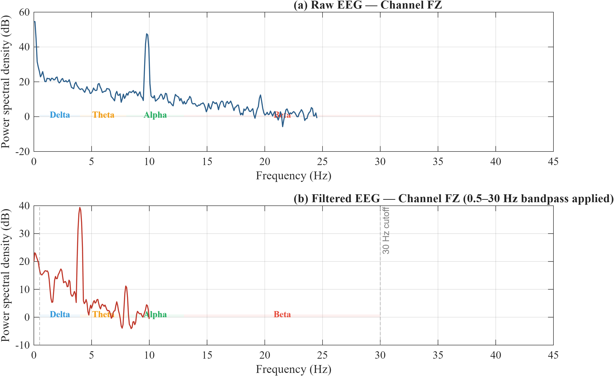

# Neurofeedback Serious Game for ADHD Attention Training


> Real-time EEG-driven game where a child's sustained attention controls a rocket's flight path. The system reads theta/beta ratio from a QNeuro 8-channel EEG cap and converts it into a focus score — when the child concentrates, the rocket climbs; when attention drifts, it falls. Preprocessing pipeline validated across 15 subjects with +11.43 dB mean SNR gain.

<p align="center">
  
  <br/>
  <em>End-of-session dashboard showing focus timeline, TBR trend with regression, and session metrics.</em>
</p>

---

## Why This Exists

Kids with ADHD tend to have higher theta/beta ratios at frontocentral electrode sites — there's a substantial body of literature establishing elevated TBR as a biomarker for inattentive-type ADHD. Neurofeedback leverages this by giving the child a real-time signal tied to their own brain state, letting them learn to self-regulate over repeated sessions.

Most existing neurofeedback setups use passive bar-graph displays or generic animations. The problem is that these aren't engaging enough for the target population — children who, by definition, struggle with sustained attention. This project wraps the feedback loop inside a game with actual stakes (score, difficulty levels, visual rewards), which makes the training more ecologically valid and keeps the child invested.

---

## How It Works

```
QNeuro 8-ch EEG Cap
        │
        │  Lab Streaming Layer (LSL)
        ▼
┌─────────────────────────────────────────────┐
│  pipe5.py — Preprocessing Pipeline          │
│                                             │
│  Baseline correction                        │
│       → 0.5–30 Hz Butterworth bandpass      │
│       → Amplitude-based artifact rejection  │
│       → Savitzky-Golay smoothing            │
│       → Band power extraction (Welch PSD)   │
│       → CSV logging (raw EEG, filtered,     │     
│         band powers, PPG)                   │
└─────────────────────────────────────────────┘
        │
        │  LSL (same stream, both read it)
        ▼
┌─────────────────────────────────────────────┐
│  adhd_neurofeedback_game.py                 │
│                                             │
│  Grabs 4-second windows from FZ + CZ       │
│       → Same filter chain as pipe5          │
│       → Welch PSD → theta & beta power      │
│       → TBR = theta / beta                  │
│       → Maps TBR to focus score (0–1)       │
│         against 20s calibration baseline    │
│                                             │
│  Focus score drives:                        │
│       • Rocket altitude                     │
│       • Score accumulation                  │
│       • Reward events (sound + popup)       │
│       • Post-session dashboard + PNG export │
└─────────────────────────────────────────────┘
```

Both `pipe5.py` and the game connect to the same LSL stream independently. The pipeline handles data logging; the game handles feedback. You can run them together or the game alone.

---

## Supported Protocols

Four neurofeedback protocols are available, chosen per session from the start menu:

| Protocol | What It Measures | Why |
|---|---|---|
| Theta / Beta | Ratio of θ (4–8 Hz) to β (13–30 Hz) | Standard ADHD neurofeedback protocol — high TBR correlates with inattention |
| Beta Enhancement | Absolute β power (13–30 Hz) | Targets cortical under-arousal |
| SMR | Sensorimotor rhythm (12–15 Hz) | Linked to reductions in impulsivity and motor restlessness |
| Alpha / Theta | Ratio of α to θ | Relaxation-oriented; useful for anxiety-comorbid presentations |

---

## Difficulty Levels

| Level | Focus Threshold | Sustain Time | Distractors |
|---|---|---|---|
| Easy | +8% above resting baseline | 1.0 s | 0 |
| Medium | +15% | 1.5 s | 3 |
| Hard | +22% | 2.5 s | 5 |
| Expert | +30% | 3.5 s | 8 |

The idea is to start on Easy and step up across sessions as the child's regulation improves. Threshold is always relative to that session's own calibration, so it adapts to day-to-day variation.

---

## Preprocessing Validation

Ran the pipeline on recordings from 15 subjects to quantify the signal cleaning:

| | Value |
|---|---|
| Raw SNR (mean ± SD) | 4.08 ± 2.07 dB |
| Post-preprocessing SNR | 15.51 ± 1.70 dB |
| **Improvement** | **+11.43 ± 2.15 dB** |
| Subjects with improvement | 15 / 15 |

Full per-subject breakdown is in [`results/SNR_RESULT.txt`](results/SNR_RESULT.txt).

<p align="center">
  
  <br/>
  <em>Channel FZ power spectral density — raw (top) vs. filtered (bottom). The bandpass removes DC drift and line noise while keeping the delta-through-beta range intact.</em>
</p>

---

## Repo Layout

```
adhd-neurofeedback-game/
├── adhd_neurofeedback_game.py    # Game: neurofeedback loop, Pygame UI, session reports
├── pipe5.py                      # Real-time EEG + PPG preprocessing, CSV export
├── visualize_eeg.py              # Montage plots, band-power heatmaps, attention traces
├── fft_bandpower_plots.py        # FFT spectrum and per-band bar charts
├── results_figures.py            # Multi-session TBR trajectory and band comparison
├── results_mat.m                 # MATLAB companion analysis
├── eyetracker/
│   ├── gazecollector.py          # Flask server collecting WebGazer gaze coords
│   └── index.html                # Browser page running WebGazer.js
├── data/
│   ├── *.csv                     # Sample band-power, filtered EEG, raw EEG recordings
│   └── fig*.png                  # Sample analysis output
├── results/
│   └── SNR_RESULT.txt            # Per-subject SNR validation table
├── requirements.txt
├── ISSUES.md                     # Known bugs and planned improvements
└── README.md
```

---

## Getting Started

```bash
git clone https://github.com/kkl24062006-commits/adhd-neurofeedback-game.git
cd adhd-neurofeedback-game
python -m venv .venv
source .venv/bin/activate        # Windows: .venv\Scripts\activate
pip install -r requirements.txt
```

Dependencies: `numpy`, `scipy`, `pygame`, `pylsl`, `matplotlib`.

---

## Running the Game

**With EEG hardware** — open two terminals, both with the venv active:

```bash
# Terminal 1 — preprocessing + data logging (optional but recommended)
python pipe5.py

# Terminal 2 — game
python adhd_neurofeedback_game.py --live
```

Wait for pipe5 to print `REAL-TIME PREPROCESSING STARTED` before launching the game. Both read the QNeuro LSL stream (`NEW1_EEG`) in parallel. If you only want the game without CSV logging, skip terminal 1.

**Without hardware:**

```bash
python adhd_neurofeedback_game.py           # replays recorded CSV data in a loop
python adhd_neurofeedback_game.py --sim     # keyboard test — hold SPACE for focus
```

**Analysis and plots:**

```bash
python visualize_eeg.py                     # EEG montage, band powers, attention heatmap
python fft_bandpower_plots.py               # FFT + band-power bars
python results_figures.py                   # cross-session TBR trends
```

---

## Controls

| Screen | Key | What it does |
|---|---|---|
| Start menu | ENTER or click | Begin session |
| Start menu | ← → arrows | Switch difficulty |
| In-game | ESC | Pause |
| In-game | Q | End session early |
| End screen | Any key | Close |

---

## Eye Tracking (optional)

There's a separate WebGazer.js-based gaze tracker under `eyetracker/` — runs in the browser and logs fixation coordinates alongside the game. Still experimental; planned as a secondary attention metric independent of EEG.

---

## Known Issues

Documented in detail in [`ISSUES.md`](ISSUES.md). The main ones:

- Distractors render on screen but don't actually interact with the rocket or score yet — the difficulty difference between levels is purely threshold-based for now
- If the 20-second live baseline calibration captures garbage data (child moves, electrode pops), there's no way to recalibrate without restarting
- No unit tests covering the signal processing math

---

## Stack

| Part | Tool |
|---|---|
| EEG hardware | QNeuro 8-channel cap, Lab Streaming Layer |
| Signal processing | NumPy, SciPy (Butterworth, Welch PSD, Savitzky-Golay) |
| Game | Pygame |
| Plots | Matplotlib |
| Analysis | Python + MATLAB |
| Gaze tracking | WebGazer.js, Flask |

---

## Context

Built for **BO3312 — Biomedical Instrumentation Lab** (Department of Biomedical Engineering). The project ties together real-time biosignal acquisition, online digital signal processing, and game-based HCI into something with actual clinical relevance.

---

## License

MIT — free for research and educational use.
